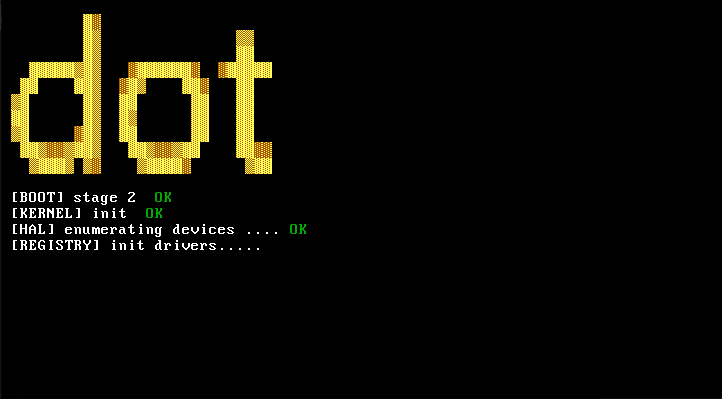

# dot - I Can't Believe It's Not Linux!



---

## Overview

dot is a small, fast operating system built around a dynamic hardware registry and an event-driven core. It focuses on clean design, modular drivers, and predictable behavior across hardware platforms; from microcontrollers to full x86 PCs. Lightweight, flexible, and easy to extend.

---

## Getting Started

1. Clone the repository:

```bash
git clone git@github.com:onecoding1/dot.git
```
